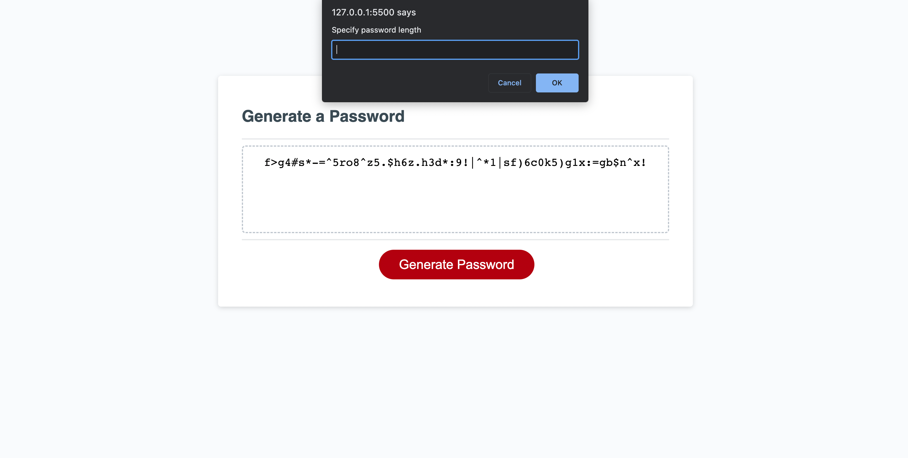

# Password Generator : JavaScript 

[Delpoyed App](https://taylorbwatters.github.io/password-generator/)

## Description 

Created a series of prompts that asked about the length of the password, if it should include lowercase/uppercase letters, numeric values and special characters. 

Set the min amount of characters to be at least 8 and the max amount of characters at 128.
If any value less than 8 in entered, it will tell the user it needs to be between 8 and 128 characters and if they would like to try again.

After all prompts are answered, a password based on the window prompts is generated.

If the user wants to generate a new password, the button will generate the same window prompt again.

## Screenshot

